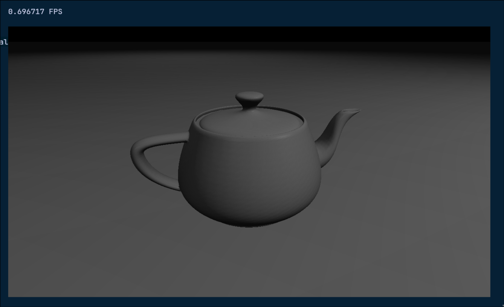
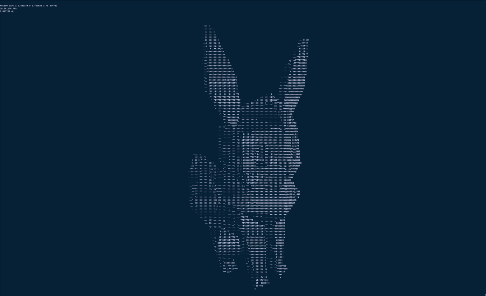
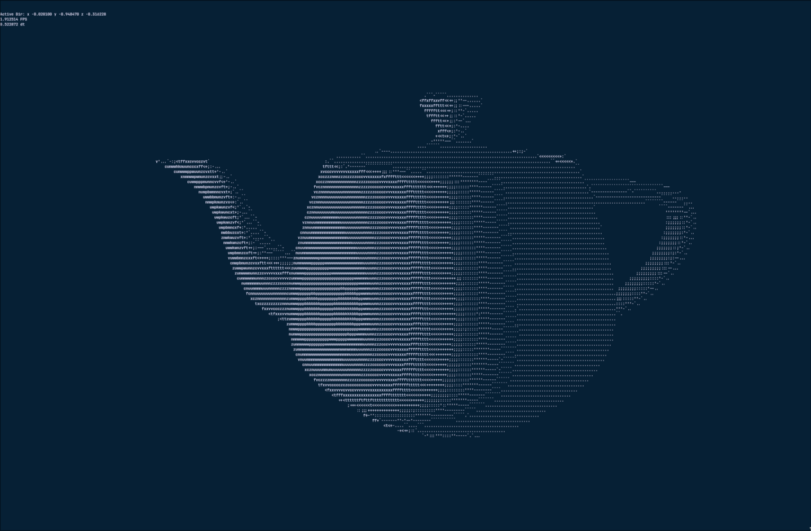

# terminal-renderer
This is a little project that lets you render a simle scene in ascii art inside a terminal.

Currently it only supports CPU rendering and simple scenes, but the idea is to build a complete renderer that supports CPU and GPU rendering, and allows the user to interact with the scene in real time like any other CAD software.

These are some captures of what I have achived so far :D

First proper image.

400 Polygons at 60 fps

~90 000 Polygons at 2 fps

